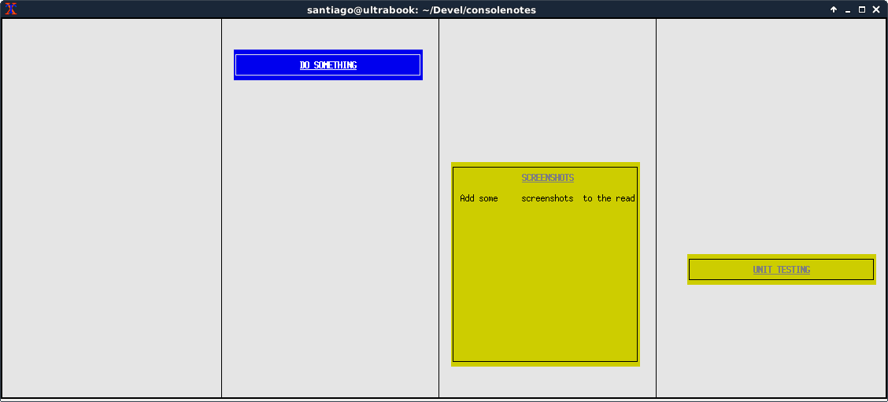

**ConsoleNotes** is a simple sticky notes application for terminal lovers. Use it to save tasks, reminders and other useful information in a simple textual/visual way.

Usage
=====

Use the cursor keys to move a note.
Type 'c' to open the note creation dialog.
Use DELETE key to delete notes.
Use SPACE key to collapse/expand the selected note.
Use the ESCAPE key to close dialogs or exit the app.

Issues
======

Set the environment variable ESCDELAY to a low value if you don't want to wait after the ESCAPE key is pressed.

